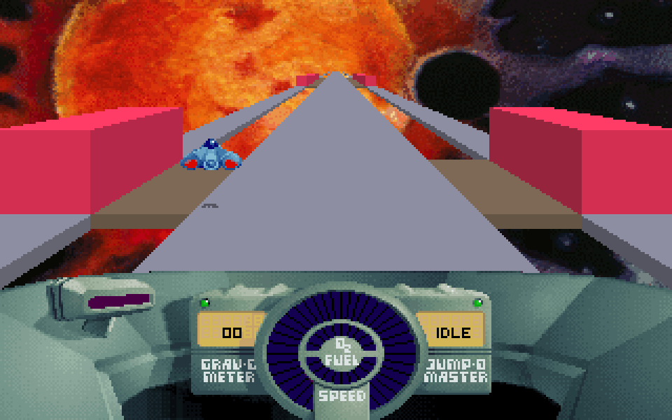
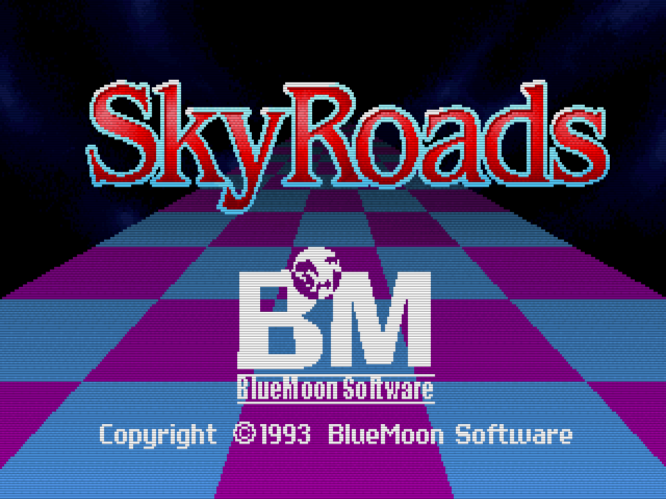

<p align="center">
  
</p>

# SkyRoads for macOS (Apple Silicon)

A native macOS port of **SkyRoads** (Bluemoon Interactive, 1993) — the classic
DOS space-racing game — rewritten in portable C with SDL2 and running natively
on Apple Silicon. No emulation, no DOSBox.


<p align="center">
  
  
</p>

## Download & play

**[⬇ Download SkyRoads for macOS (Apple Silicon)](https://github.com/pedrocatalao/skyroads-mac/releases/download/1.0/SkyRoads.zip)**

Unzip, move `SkyRoads.app` anywhere you like, and **right-click → Open** the
first time (the app isn't notarized, so macOS asks once). That's it — the app
is self-contained.

## Build from source

```bash
brew install cmake sdl2
git clone https://github.com/pedrocatalao/skyroads-mac.git
cd skyroads-mac
./native/get_data.sh        # downloads the freeware game data from bluemoon.ee
./native/make_app.sh data
open native/build/SkyRoads.app
```

That's it. `get_data.sh` fetches the game from Bluemoon's official site (the
game data is their freeware and is not part of this repo); `make_app.sh`
builds a self-contained app bundle around it.

Already have the game files? Skip `get_data.sh` and point `make_app.sh` at
your folder — DOS-style uppercase filenames (`ROADS.LZS`) are fine:

```bash
./native/make_app.sh ~/Downloads/skyroads-data
```

The app is self-contained (game data is copied into the bundle) — you can move
it to `/Applications`. Progress and settings are saved to
`~/Library/Application Support/`.

### Alternative: run from the terminal

```bash
cmake -S native -B native/build
cmake --build native/build --target skyroads
./native/build/skyroads ~/Downloads/skyroads-data
```

## Controls

| Key | Action |
|---|---|
| ← → | steer |
| ↑ ↓ | accelerate / brake |
| Space | jump |
| Enter | select (menus) |
| P | pause / unpause |
| Esc | abort road / back |
| F9 | music: wavetable ("AWE32") / AdLib FM |
| F10 | CRT effects on/off (scanlines, phosphor trails, smooth scaling) |
| Cmd-F / F11 | fullscreen |

## What's in this repo

- `native/src/` — the port:
  - `render.c` — C rewrite of the original 16-bit assembly 3D road renderer
  - `game_play.c` — the physics/collision/gameplay engine (bit-faithful
    fixed-point math)
  - `assets.c`, `menus.c` — data loaders, menu flow
  - `compat.c` — DOS runtime emulation (segment memory model, LZSS
    decompressor, file I/O)
  - `audio.c` — AdLib music driver on a software OPL2 (Nuked-OPL3, LGPL) +
    digitized sound effects
  - `platform.c` — SDL2 window/input/timing
- `native/docs/trek_blueprint.md` — reverse-engineering notes on the original
  renderer
- `native/make_app.sh` — builds the signed `SkyRoads.app` bundle

## Troubleshooting

- **"required data file … not found"** — the path you gave `make_app.sh` must
  contain the SkyRoads data files (`trekdat.lzs`, `roads.lzs`, `world*.lzs`,
  …). Point it at the folder where you unzipped the freeware download.
- **CMake can't find SDL2** — `brew install sdl2`, then delete
  `native/build` and rebuild.
- **Intel Macs** — should build and run fine too (plain C + SDL2); only
  tested on Apple Silicon.

## Credits & legal

- **SkyRoads** was created by **Bluemoon Interactive** (Ahti Heinla,
  Jaan Tallinn, and team). All game content, art, music and the original
  design are theirs. This is an unofficial fan port, not affiliated with or
  endorsed by Bluemoon; the game itself is distributed by Bluemoon as
  freeware.
- OPL2 FM synthesis via [Nuked-OPL3](https://github.com/nukeykt/Nuked-OPL3)
  (Nuke.YKT), LGPL-2.1 — see `native/src/opl3.c` for its license header.
- Wavetable music mode via [TinySoundFont](https://github.com/schellingb/TinySoundFont)
  (MIT) playing the [TimGM6mb](https://musescore.org) SoundFont (GPL,
  Tim Brechbill), fetched by `get_data.sh` — the instrument mapping was
  reconstructed from the original Sound Club song sources.
